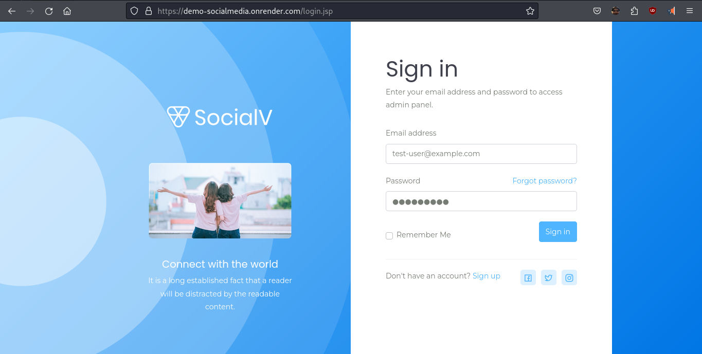
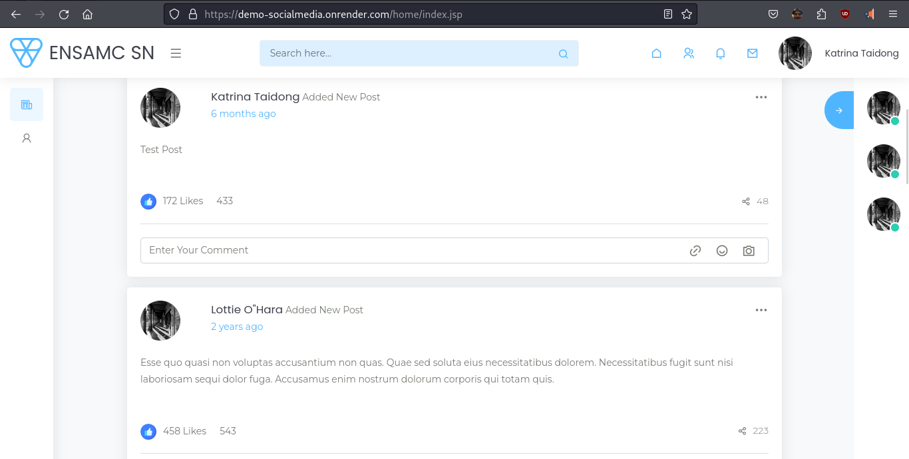

# Social Media Platform Demo

A functional social media platform prototype developed using Java EE technologies.

## Features

- User account management
- Friend request system (pending, approved, denied states)
- Post creation and viewing
- User profiles and timelines
- Custom password reset functionality with one-time use personal tokens

## Screenshots

Here are some images to illustrate the project:

* Login Screen: 
 
* User's Feed: 
 
* Friend Requests: 
 

## Technologies Used

- Backend: Java EE
- Database: PostgreSQL or MySQL
- Frontend: HTML, CSS, JavaScript (with 'SocialV Lite' template)
- Deployment: Render.com [Demo SocialMedia](https://demo-socialmedia.onrender.com)
  (Render's free plan spins down the web app if not used in 30 minutes, so you might need to wait 3–5 minutes for the app to build again and start running)

## Setup and Installation

1. Clone the repository
2. Set up PostgreSQL (or MySQL; a file for database creation is included `db-creation-mysql.sql`) database and configure connection settings
3. Deploy the application on a Java EE compatible server (e.g., Tomcat)
4. Access the application through your web browser

## Usage

1. Create a new account or log in
2. Explore user profiles and send friend requests
3. Create and view posts on your timeline
4. Manage your friend list and account settings

## Future Improvements

- Implement real-time notifications
- Add media sharing capabilities
- Enhance search functionality
- Implement real-time chat

## Contact

[Contact Me](mailto:isam.soufiane1@gmail.com)
